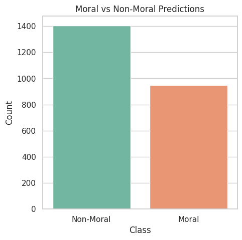
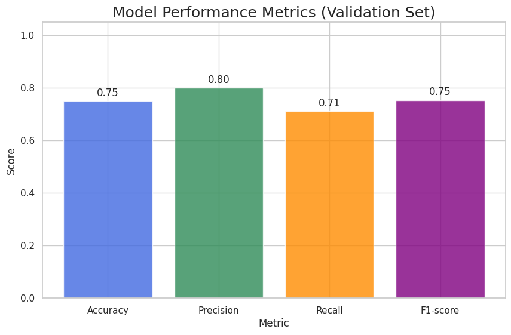

# Automatic Detection of Moral Values in Research Papers

This project presents an automated pipeline for detecting moral and ethical values in Artificial Intelligence (AI) and Machine Learning (ML) research papers.  
Ethical analysis of research literature is typically performed manually, which is time-consuming and difficult to scale. This work demonstrates how Natural Language Processing (NLP) techniques can be used to automatically identify moral values across large collections of scientific publications.

The system processes research papers in PDF format, extracts textual content, and predicts the presence of moral values such as fairness, transparency, privacy, and accountability. The approach enables scalable analysis of ethical trends in AI research and supports reproducible, data-driven evaluations.

---

## Key Features

- Automated PDF text extraction from research papers  
- Zero-shot moral value detection using pretrained language models  
- Supervised multi-label moral value classification using RoBERTa  
- Large-scale analysis on DBLP conference publications  
- Visualization and analysis of moral vs non-moral classification results  

---

## Dataset

- **Seed Papers**  
  99 research papers manually annotated with moral values (used as the training set)

- **DBLP Conference Papers**  
  250+ papers from major AI conferences (used for large-scale testing and analysis)

---

## Technologies Used

- Python  
- Hugging Face Transformers  
- RoBERTa  
- Scikit-learn  
- Pandas, Matplotlib, Seaborn  

---

## Results and Analysis

### Moral vs Non-Moral Classification

  

This confusion matrix illustrates how effectively the model distinguishes between papers that contain moral content and those that do not.  
- **True Positives** correspond to papers correctly identified as containing moral values.  
- **True Negatives** represent papers correctly classified as non-moral.  
The strong diagonal pattern indicates reliable separation between moral and non-moral papers.

---

### Distribution of Detected Moral Values

  

This figure compares the **ground-truth distribution** of moral values from manually annotated seed papers with the **model’s predictions**.  
The similarity between the two distributions shows that the model captures moral patterns consistent with human judgment.

---

  

This chart shows how frequently each moral value is predicted across the evaluated papers.  
Values such as fairness and transparency appear more frequently, reflecting their prominence in contemporary AI research discussions.

---

  

These per-value confusion matrices provide a detailed view of how accurately individual moral values are detected.  
They help identify which values are easier to classify and which may require additional training data or refinement.

---

## Conclusion

This project demonstrates that transformer-based models can effectively detect moral and ethical values in research papers at scale.  
By automating ethical analysis, the system enables broader, faster, and more consistent examination of moral considerations in AI research literature.

---

## Future Work

- Extend analysis to additional conferences and research domains  
- Conduct human evaluation studies to validate model predictions  
- Explore retrieval-based ethical trend analysis  
- Improve detection of rare or subtle moral values  

---

**Note:**  
This repository focuses on transparency and reproducibility. Sample outputs and visualizations are included to support interpretation and further experimentation.
