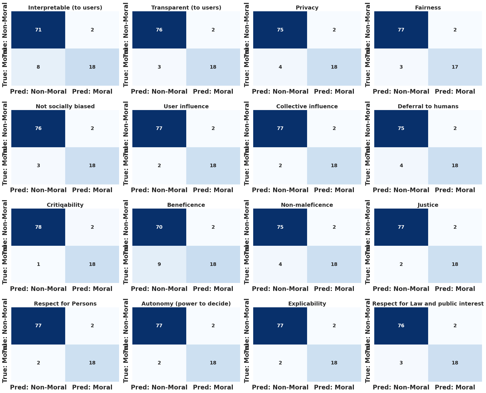

# Automatic Detection of Moral Values in Research Papers

This project presents an automated pipeline to detect moral and ethical values in AI and Machine Learning research papers.

## Key Features
- PDF text extraction
- Zero-shot moral value detection
- Supervised multi-label classification using RoBERTa
- Analysis on DBLP conference papers

## Dataset
- 99 seed papers (manually annotated)
- 250+ DBLP conference papers

## Technologies
- Python
- Hugging Face Transformers
- RoBERTa
- Scikit-learn
### Moral vs Non-Moral Classification

  

